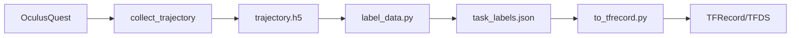

# role-ros2: Robot Learning Full Stack on ROS2

<div align="center">

[](LICENSE)
[](https://www.ros.org/)

</div>

<div align="center">
  
</div>

<br>

**role-ros2** (Robot Learning ROS2) is a unified robot learning full stack built on the ROS2 open-source ecosystem. It provides end-to-end tools for data collection (VR teleoperation), labeling, conversion, and camera calibration, with Docker-based separation of robot hardware and algorithms for modularity.

- An integrated toolchain for robot learning: VR data collection, labeling, conversion to TFDS/RLDS, and Charuco-based hand-eye calibration—all in one platform.

- Docker container separation of camera/GPU and robot control, enabling modular deployment and clean hardware–software decoupling.

- VR teleoperation with Oculus Quest controlling Franka Panda (single-arm and bimanual) for real-time trajectory collection.

- DROID / TFDS unified data format compatible with RLDS schema, ready for LeRobot and other training frameworks.

- A Gym-compatible `RobotEnv` interface for imitation learning and reinforcement learning research.

## Quick Start

### Prerequisites

- **Docker** and **Docker Compose**
- **NVIDIA GPU** (optional, for ZED cameras): Requires `nvidia-container-toolkit`
- **X11** (optional, for GUI apps like rviz2): `xhost +local:root` on host

### Full Stack (Camera + Robot)

```bash
# 1. Build and start Docker (from repository root)
docker compose -f docker/ros2_cu118_franka_0.18.x/docker-compose.yaml build
docker compose -f docker/ros2_cu118_franka_0.18.x/docker-compose.yaml up -d

# 2. Enter container and build workspace
docker exec -it ros2_cu118_container bash
cd /app/ros2_ws && colcon build --symlink-install && source install/setup.bash

# 3. Launch bringup control center (from project root)
cd /app/ros2_ws/src/role-ros2 && python3 scripts/bringup.py
```

> [!IMPORTANT]
> For detailed installation, environment selection (ros2_cu118, ros2_franka, full stack), X11 setup, and troubleshooting, see [docker/install.md](docker/install.md).

## Robots & Control

role-ros2 provides unified robot interfaces and VR-based teleoperation:

| Robot | Class | Use Case |
|-------|-------|----------|
| Single-arm Franka | `FrankaRobot` | One-arm manipulation |
| Bimanual Franka | `BimanualFrankaRobot` | Two-arm manipulation |

**VR control (Oculus Quest)**:
- **Hold GRIP** → Enable robot movement
- **Long press A/X** (0.5 s) → **SUCCESS**: Save trajectory, reset, start new
- **Long press B/Y** (0.5 s) → **FAILURE**: Discard, reset, start new

**Action spaces**: `cartesian_velocity`, `cartesian_position`, `joint_velocity`, `joint_position`

```python
from role_ros2.robot.franka.robot import FrankaRobot
import rclpy

rclpy.init()
robot = FrankaRobot()

# Move to joint position
robot.update_joints([0.0, -0.785, 0.0, -2.356, 0.0, 1.571, 0.785], velocity=False)

# Move to Cartesian position
robot.update_pose([0.5, 0.0, 0.5, 0.0, 0.0, 0.0], velocity=False)

# Control gripper
robot.update_gripper(0.04)  # Open to 4 cm
```

### Robot Environment (Gym-compatible)

```python
from role_ros2.robot_env import RobotEnv
import rclpy

rclpy.init()
env = RobotEnv()

obs = env.get_observation()
# obs: 'robot_state', 'images' (camera dict)

action = env.action_space.sample()
obs, reward, done, info = env.step(action)
```

## Data Pipeline

role-ros2 collects trajectories via VR, labels them, and converts to TFRecord/TFDS for training:



1. **Collect**: `collect_trajectory_franka.py` / `collect_trajectory_bimanual_franka.py` → HDF5 files
2. **Label**: `label_data.py` → `task_labels.json` (success/failure, task_name)
3. **Convert**: `to_tfrecord.py` → TFDS/RLDS, DROID-compatible schema

Output: `role_ros2-train.tfrecord-*`, `dataset_info.json`, loadable via `tfds.builder_from_directory()`.

## Scripts & Tools

| Script | Description |
|--------|-------------|
| `bringup.py` | Docker-ROS control center (PyQt5 GUI) |
| `collect_trajectory_franka.py` | Single-arm VR trajectory collection |
| `collect_trajectory_bimanual_franka.py` | Bimanual VR trajectory collection |
| `replay_trajectory.py` | Replay HDF5 trajectories on robot |
| `calibrate_camera.py` | Charuco hand-eye calibration |
| `postprocess/label_data.py` | Label success/failure and task_name |
| `postprocess/to_tfrecord.py` | Convert .h5 → TFRecord/TFDS |
| `misc/trajectory_visualizer.py` | Visualize trajectories (Matplotlib) |
| `misc/hdf5_reader.py` | Inspect HDF5 structure |
| `misc/visualize_tfds.py` | Visualize TFDS/RLDS datasets |

> For detailed usage, arguments, examples, and trajectory structure, see [scripts/README.md](scripts/README.md).

## Docker Architecture

| Container | Purpose | ROS2 | Stack |
|-----------|----------|------|-------|
| `ros2_cu118_container` | Camera, GPU, ZED | Humble | CUDA 11.8, ZED SDK |
| `ros2_polymetis_container` | Robot control | Foxy | Polymetis, libfranka 0.14.x / 0.18.x |

- **Camera only**: `docker/ros2_cu118/`
- **Robot only**: `docker/ros2_franka_libfranka_0.14.x/` or `0.18.x/`
- **Full stack**: `docker/ros2_cu118_franka_0.14.x/` or `0.18.x/`

Both containers communicate via shared `ROS_DOMAIN_ID` and `network_mode: host`. See [docker/install.md](docker/install.md) for details.

## Package Structure

```
role-ros2/
├── assets/                     # Images and diagrams
│   └── banner.png             # Architecture overview
├── scripts/                    # Python script tools
│   ├── bringup.py             # Docker-ROS control center (GUI)
│   ├── collect_trajectory_franka.py
│   ├── collect_trajectory_bimanual_franka.py
│   ├── replay_trajectory.py
│   ├── calibrate_camera.py
│   ├── conf/                  # bringup.py configs
│   │   ├── franka.json
│   │   └── biman_franka.json
│   ├── misc/                  # hdf5_reader, trajectory_visualizer, etc.
│   └── postprocess/           # label_data, to_tfrecord
├── launch/                     # franka_robot, zed_camera, oculus_controller
├── config/                     # Robot, camera, calibration YAML
├── docker/                      # ros2_cu118, ros2_franka_*, ros2_cu118_franka_*
├── nodes/                       # ROS2 nodes (robot, gripper, aggregator)
└── role_ros2/                   # Python modules
    ├── robot/                   # FrankaRobot, BimanualFrankaRobot
    ├── robot_env.py             # Gym environment
    ├── controllers/             # VRPolicy, VRBimanPolicy
    ├── camera/                  # Multi-camera reader
    ├── trajectory_utils/        # collect_trajectory_base, trajectory_writer
    ├── calibration/             # Charuco hand-eye
    └── robot_ik/                # Inverse kinematics
```

## Topics

| Category | Topic | Type |
|----------|-------|------|
| Robot | `/joint_states`, `/robot_state` | JointState, RobotState |
| Camera | `/hand_camera/zed_node/rgb/image_rect_color` | Image |
| Oculus | `/oculus/right_controller/pose`, `/oculus/buttons` | PoseStamped, OculusButtons |

## Resources

- **[docker/install.md](docker/install.md)** — Docker installation, build, run, X11, troubleshooting
- **[scripts/README.md](scripts/README.md)** — Script usage, arguments, examples, trajectory structure
- [Franka ROS2](https://github.com/souljaboy764/franka_ros2)
- [ZED ROS2 Wrapper](https://github.com/stereolabs/zed-ros2-wrapper)

## Related Projects

role-ros2's data format and toolchain are inspired by and compatible with the following projects:

- **[DROID](https://github.com/droid-dataset/droid)** — Distributed Robot Interaction Dataset; in-the-wild robot manipulation data and teleoperated collection platform
- **[LeRobot](https://github.com/huggingface/lerobot)** — Hugging Face's real-world robotics library (PyTorch): models, datasets, and policies for robot learning

Thanks to the DROID and LeRobot communities for their open-source contributions to robot learning.

## Contributing

Contributions are welcome. Please ensure:

1. Code follows ROS2 and Python best practices (PEP 8)
2. Documentation and comments are added
3. Related README and docs are updated

## License

Apache-2.0